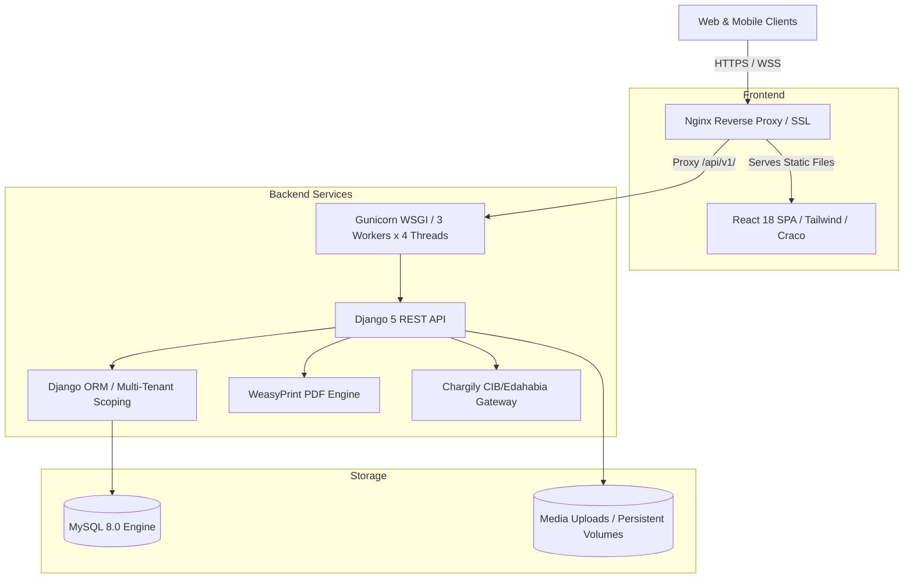

<div align="center">

# 🎓 Scolaris (SchoolDz)
### Cloud ERP & Management Operating System for Modern Education Centers

[](https://python.org)
[](https://djangoproject.com)
[](https://react.dev)
[](https://tailwindcss.com)
[](https://mysql.com)
[](https://docker.com)
[](LICENSE)

<p align="center">
  <b>An enterprise-grade, multi-tenant school operating platform engineered for private tutoring centers, language schools, and training academies.</b>
  <br />
  Featuring automated financial accounting, multi-party pardon split engine, dynamic attendance rosters, teacher payroll reconciliation, and multi-lingual Arabic/French/English localization with full RTL support.
</p>

[Key Features](#-key-features) •
[Architecture](#-architecture) •
[Quickstart](#-quickstart--local-development) •
[Production Deployment](#-production-deployment-vps) •
[Financial Engine](#-financial-accounting-engine) •
[Configuration](#-environment-configuration)

---

</div>

## 🌟 Key Features

### 🏢 Multi-Tenant Architecture & Branding
- **Complete Data Isolation:** Automated tenant scoping across all models and queries via `TenantScopedViewSet`.
- **Custom School Portals:** Each institution configures custom prefixes (`INV-`, `STU-`), currencies (`DZD`, `EUR`, `USD`), custom logo, and landing page slugs (`/enroll/<slug>`).
- **Subscription Management:** Automated plan enforcement (`Basic`, `Standard`, `Premium`) with student limits, role entitlements, and subscription expiry tracking.

### 💰 Financial Accounting & Advanced Invoicing
- **Multi-Item Billing:** Single invoices grouping multiple items (courses, textbooks, academic trips) with item-level audit trails.
- **Three-Way Pardon & Waiver Engine:**
  - **Full Pardon (`both`):** 100% waiver (Student pays 0 DZD, Teacher receives 0 DZD).
  - **School Waiver (`school`):** School waives its share; student pays only the teacher's percentage (`amount × teacher_pct / 100`). Teacher earnings are preserved.
  - **Teacher Waiver (`teacher`):** Teacher waives their percentage; student pays only the school's cut (`amount × school_pct / 100`). Teacher earns 0 DZD.
- **Dynamic Cash Flow Tracking:** Real-time calculation of net revenue, operating expenses, unpaid pending debts, and teacher payouts due.
- **Printable Invoices:** High-resolution PDF generation via WeasyPrint with custom typography, bilingual metadata, and Arabic RTL layout support.
- **Algerian Payment Gateway Integration:** Chargily Pay integration supporting CIB and EDAHABIA cards with automatic webhook reconciliation.

### 👨‍🏫 Teacher Payroll & Attendance-Based Royalties
- **Dynamic Commission Splits:** Custom percentages per teacher, per course, or overridden per individual billing line item.
- **Session Attendance Accrual:** Automatic teacher balance accrual driven by verified student attendance (`present`/`late`), protecting the center against uncollected student debt.
- **Multi-Stream Earnings:** Combines regular classroom session pay, standalone course sales, and author book royalties.
- **Payout Ledger:** Teacher payout disbursement tracking with overdraft protections and balance validation.

### 📋 Attendance & Classroom Management
- **Interactive Session Rosters:** Fast attendance marking (`present`, `absent`, `late`, `excused`) with student debt indicators directly on the roster.
- **Session Sheets & ID Cards:** Printable classroom session sheets and laminated student ID cards with student barcodes.
- **Conflict-Free Timetable:** Visual timetable planner with classroom and room collision checks.

### 📚 Inventory, Trips & Academic Records
- **Book Inventory:** ISBN tracking, in-stock counters, barcode identification, and lending logs with automatic author royalty distribution.
- **Field Trips:** Participant capacity limits, seat reservations, and parent authorization workflows.
- **Gradebook & Quizzes:** Online quiz builder, student submissions, evaluation tracking, and transcript report generation.

### 🌐 Multi-Language & Modern UI/UX
- **Trilingual System:** Native support for **Arabic (العربية)**, **French (Français)**, and **English (US)**.
- **Bi-Directional RTL/LTR:** Automatic interface flipping, font swapping (Cairo/Tajawal for Arabic, IBM Plex Sans and Cabinet Grotesk for Latin).
- **Responsive Dark/Light Mode:** Ergonomic theme switcher with high-contrast data visualization.

---

## 🏗 Architecture



---

## 📁 Repository Structure

```text
SchoolDz/
├── django-backend/             # Django 5 Backend Core
│   ├── api/                    # Core REST API application
│   │   ├── migrations/         # Database migrations (0001 - 0044)
│   │   ├── models.py           # Enterprise relational data models
│   │   ├── serializers.py      # DRF ModelSerializers & validation
│   │   ├── views.py            # Business logic, finance engines & endpoints
│   │   ├── services.py         # Third-party integrations (Chargily, Google)
│   │   ├── tests.py            # Financial & core unit tests
│   │   └── templates/          # HTML templates for WeasyPrint PDFs (Invoices, ID cards)
│   ├── schooldz/               # Django root project configuration (settings, WSGI, URLs)
│   ├── requirements.txt        # Backend dependencies
│   └── Dockerfile              # Production multi-stage Docker image
│
├── frontend/                   # React 18 SPA Frontend
│   ├── src/
│   │   ├── components/         # Reusable UI component library (shadcn/ui & Radix)
│   │   ├── pages/              # Application modules (Dashboard, Payments, Teachers, etc.)
│   │   ├── lib/
│   │   │   ├── api.js          # Centralized Axios client & interceptors
│   │   │   └── i18n.jsx        # Localization engine (Arabic, French, English)
│   │   └── App.jsx             # Top-level routing and state providers
│   ├── build/                  # Production-compiled static assets
│   ├── package.json            # Node.js dependencies and build scripts
│   └── tailwind.config.js      # Design token & typography configuration
│
├── mobile-parent/              # Mobile portal for Parents (Flutter / React Native)
├── mobile-student/             # Mobile portal for Students
├── mobile-teacher/             # Mobile portal for Teachers
├── launch.sh                   # Comprehensive local dev launcher & orchestrator
└── README.md                   # Platform documentation
```

---

## ⚡ Quickstart / Local Development

### Prerequisites
- **Linux** (Ubuntu/Debian recommended) or macOS
- **Docker** & **Docker Compose**
- **Node.js** >= 18 & **npm** >= 9
- **Python** 3.11+ (optional if using Docker backend)

### 1. Clone the Repository
```bash
git clone https://github.com/Aizen00Rayen/SchoolDz.git
cd SchoolDz
```

### 2. Automated Single-Command Launch
The included [`launch.sh`](file:///home/aizen/Desktop/SchoolDz-main/launch.sh) manages container orchestration, database seeding, environment creation, migrations, and frontend compilation automatically:

```bash
chmod +x launch.sh
./launch.sh
```

`launch.sh` will:
1. Verify system ports (`3306`, `8002`, `3000`).
2. Provision MySQL 8.0 container (`schooldz-mysql`).
3. Build and launch Django backend container (`schooldz-django-backend`).
4. Execute pending database migrations automatically.
5. Create standard Superadmin user (`admin@schooldz.com` / `khsUuapZydjhYRLz`).
6. Start the React development server on `http://localhost:3000`.

### 3. Stop Local Services
```bash
./launch.sh stop
```

---

## 🚀 Production Deployment (VPS)

### Typical Production Architecture
- **Operating System:** Ubuntu 22.04 / 24.04 LTS (Hostinger, DigitalOcean, Hetzner)
- **Web Server:** Nginx with SSL (Let's Encrypt / Certbot)
- **Backend Service:** Dockerized Gunicorn on `127.0.0.1:8002`
- **Database:** Dedicated MySQL 8.0 instance
- **Frontend:** Static files served directly by Nginx from `/var/www/scolaris.cloud`

### 1. Server Setup & Repository Pull
```bash
cd ~/scolaris
git pull origin main
```

### 2. Update Frontend Web Root
Copy the pre-compiled production build directly to the Nginx web root:
```bash
sudo cp -r ~/scolaris/frontend/build/* /var/www/scolaris.cloud/
sudo systemctl reload nginx
```

### 3. Build & Re-run Backend Container
```bash
cd ~/scolaris
docker build --no-cache -t scolaris-backend django-backend/

docker stop scolaris-backend && docker rm scolaris-backend

docker run -d --name scolaris-backend \
  --network scolaris-net \
  --env-file ~/scolaris/django-backend/.env \
  -v ~/scolaris/media:/app/uploads \
  -p 8002:8002 \
  --restart unless-stopped \
  scolaris-backend

docker exec scolaris-backend python manage.py migrate
```

### 4. Sample Nginx Configuration (`/etc/nginx/sites-available/scolaris.cloud`)
```nginx
server {
    server_name scolaris.cloud www.scolaris.cloud;
    root /var/www/scolaris.cloud;
    index index.html;

    # Static React SPA routing
    location / {
        try_files $uri $uri/ /index.html;
    }

    # Static assets caching
    location /static/ {
        expires 1y;
        add_header Cache-Control "public, immutable";
    }

    # Django REST API proxy
    location /api/ {
        proxy_pass http://127.0.0.1:8002;
        proxy_set_header Host $host;
        proxy_set_header X-Real-IP $remote_addr;
        proxy_set_header X-Forwarded-For $proxy_add_x_forwarded_for;
        proxy_set_header X-Forwarded-Proto $scheme;
    }

    # User uploads and media
    location /uploads/ {
        alias /home/aizen/scolaris/media/;
        expires 30d;
    }
}
```

---

## 🧮 Financial Accounting Engine

Scolaris incorporates an exact, audit-tested accounting engine designed specifically for educational business models:

### 1. Pardon & Waiver Calculations
$$\text{Discount}_{\text{both}} = \text{Course Price}$$
$$\text{Discount}_{\text{school}} = \text{Course Price} \times \left(\frac{\text{School Percentage}}{100}\right)$$
$$\text{Discount}_{\text{teacher}} = \text{Course Price} \times \left(\frac{\text{Teacher Percentage}}{100}\right)$$

$$\text{Student Payable} = \text{Course Price} - \text{Discount}$$

### 2. Teacher Earnings Rules
- If **Pardon Type = `school`**: Teacher cut is preserved ($\text{Course Price} \times \frac{\text{Teacher \%}}{100}$).
- If **Pardon Type = `teacher`** or **`both`**: Teacher earnings for that course are **$0\text{ DZD}$**.
- Attendance for teacher-waived students is excluded from teacher commission accrual.

### 3. Net Profit Formula
$$\text{Net Profit} = \text{Gross Revenue} - \text{Teacher Share} - \text{Operating Expenses}$$

All figures across the **Dashboard Summary**, **Master Dashboard**, and **P&L Finance Reports** reconcile with zero mathematical discrepancy.

---

## ⚙️ Environment Configuration

### Backend Configuration (`django-backend/.env`)
| Key | Description | Example |
| :--- | :--- | :--- |
| `SECRET_KEY` | Django cryptographic secret | `django-insecure-...` |
| `DEBUG` | Enable debug mode (false in prod) | `False` |
| `ALLOWED_HOSTS` | Whitelisted hostnames | `localhost,scolaris.cloud` |
| `DB_NAME` | MySQL database name | `schooldz` |
| `DB_USER` | MySQL database user | `schooldz` |
| `DB_PASSWORD` | MySQL user password | `SecretPassword123!` |
| `DB_HOST` | MySQL host / container IP | `127.0.0.1` |
| `DB_PORT` | MySQL connection port | `3306` |
| `CHARGILY_API_KEY` | Live Chargily secret key | `api_sk_...` |
| `CHARGILY_WEBHOOK_SECRET`| Live Chargily webhook signature | `secret_...` |
| `DEFAULT_FROM_EMAIL` | Outgoing system notifications | `no-reply@scolaris.cloud` |

### Frontend Configuration (`frontend/.env`)
| Key | Description | Example |
| :--- | :--- | :--- |
| `REACT_APP_BACKEND_URL` | Base URL for API requests | `https://scolaris.cloud` |

---

## 🧪 Testing

Execute the comprehensive financial and module test suite:

```bash
docker exec schooldz-django-backend python manage.py test api.tests --keepdb
```

Frontend production build check:
```bash
cd frontend && npm run build
```

---

## 📄 License & Attribution

Developed with ❤️ for educational institutions in Algeria and North Africa.
Proprietary software — All rights reserved by **Aizen00Rayen / Scolaris**.
